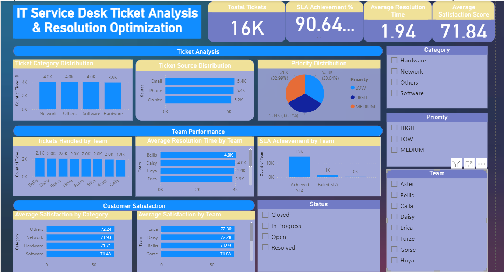

# IT Service Desk Ticket Analysis & Resolution Optimization

## Project Overview

This project focuses on analyzing IT service desk tickets to improve operational efficiency, reduce ticket resolution time, monitor SLA compliance, and enhance customer satisfaction.

The project follows the complete Data Analysis Process, including business understanding, data preparation, data cleaning, analysis, visualization, and business recommendations.


## Business Problem

Organizations receive thousands of IT support tickets every month. Delayed ticket resolution can reduce employee productivity, impact business operations, and lower customer satisfaction.

The objective of this project is to analyze ticket data and identify opportunities to improve service desk performance.


## Objectives

- Analyze ticket volume and distribution.
- Measure SLA achievement rates.
- Evaluate team performance.
- Identify categories generating the highest number of tickets.
- Analyze customer satisfaction scores.
- Monitor ticket resolution efficiency.
- Provide actionable business recommendations.


## Tools & Technologies Used

- Microsoft Excel
- SQL Server (SSMS)
- Python (Pandas, Matplotlib)
- Power BI
- Git & GitHub


## Data Analysis Process

### 1. Ask

Defined the business problem related to ticket management, SLA compliance, and customer satisfaction.

### 2. Prepare

Collected and explored the service desk ticket dataset.

### 3. Process

Performed data cleaning and transformation using SQL and Python.

Tasks included:
- Handling date and time fields
- Data validation
- Feature creation
- Resolution time calculation

### 4. Analyze

Performed analysis on:

- Ticket Categories
- Priority Levels
- Ticket Sources
- Team Performance
- SLA Achievement
- Resolution Time
- Customer Satisfaction

### 5. Share

Created an interactive Power BI dashboard to communicate findings and recommendations.


## Key Performance Indicators (KPIs)

- Total Tickets: 16,000
- SLA Achievement Rate: 90%+
- Average Resolution Time: 1.94 Days
- Average Satisfaction Score: 71.84


## Key Insights

### Ticket Analysis

- Network category generated the highest number of tickets.
- Hardware category generated the lowest number of tickets.
- Ticket volume was distributed fairly evenly across categories.

### SLA Analysis

- More than 90% of tickets achieved SLA targets.
- SLA failures represented a small percentage of total tickets.

### Team Performance

- Teams handled ticket workloads relatively evenly.
- Resolution efficiency varied slightly among teams.

### Customer Satisfaction

- Customer satisfaction remained above 70 across all categories.
- The "Others" category recorded the highest average satisfaction score.


## Business Recommendations

### 1. Reduce Network-Related Issues

Implement proactive monitoring and root-cause analysis to reduce recurring network incidents.

### 2. Improve SLA Compliance

Focus on high-priority tickets and strengthen escalation processes.

### 3. Optimize Team Performance

Share best practices from top-performing teams and balance ticket workloads.

### 4. Enhance Customer Experience

Continuously monitor satisfaction scores and address recurring customer concerns.


## Dashboard Preview




## Project Structure

```text
IT-Service-Desk-Ticket-Analysis
│
├── Dataset
│   └── tickets_cleaned.csv
│
├── SQL
│   └── ticket_analysis_queries.sql
│
├── Python
│   └── ticket_analysis.ipynb
│
├── PowerBI
│   └── TicketAnalysis.pbix
│
├── Images
│   └── dashboard.png
│
└── README.md
```


## Skills Demonstrated

- Data Cleaning
- Exploratory Data Analysis (EDA)
- SQL Querying
- Business Analysis
- Data Visualization
- Dashboard Development
- KPI Tracking
- SLA Analysis
- Customer Satisfaction Analysis
- Problem Solving


## Author

Trupti Naikwadi

